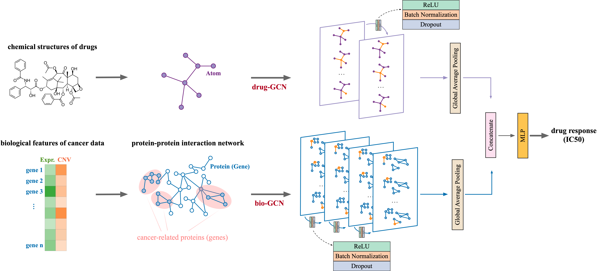

# DualGCN

DualGCN: a dual graph convolutional network model to predict cancer drug response

DualGCN is a unified Dual Graph Convolutional Network model to predict cancer drug response. It takes chemical structure information of a drug and gene features of a cancer sample as inputs and outputs IC50.

 
 
 # Requirements
- Keras == 2.1.4
- TensorFlow == 1.13.1
- hickle == 2.1.0
- numpy >= 1.19.2
- scipy >= 1.5.2
- sklearn >= 0.24.2
- pandas >= 1.1.3

# Installation
DualGCN can be downloaded by
```shell
git clone https://github.com/horsedayday/DualGCN
```
Installation has been tested in a Linux/MacOS platform.

# Instructions
## Cell line data preparation
We collected gene expression and copy number variation data from [CCLE database](https://depmap.org/portal/download/). These gene features of cell lines could be found in `data/CCLE/omics_data`. We curated cancer-related genes from the TCGA and COSMIC. These genes were used and could be found in `data/CCLE/gene_list.txt`. We filtered out cell lines if (1) either gene expression or CNV data are unavailable, or (2) cancer type annotations are missed, or (3) sample size of the corresponding cancer type is less than 10. Finally, we collected 525 cell lines covering 27 kinds of cancers. Lists of these cell lines could be found in `data/CCLE/cellline_list.txt`. We built graphs of cancer samples with protein-protein interactions (PPIs). These PPIs were obtained from [STRING database](https://string-db.org/) (version 11.0). These PPI data could be found in `data/PPI/PPI_network.txt`. 

## Drug data preparation
Drug information was obtained from the [GDSC database](https://www.cancerrxgene.org/compounds)(version: GDSC1). We only kept drugs that are recorded in the PubChem. In addition, drugs sharing the same PubChem identifiers but owning different GDSC identifiers were also filtered out. Finally, we collected 208 drugs. We applied [deepchem](https://github.com/deepchem/deepchem) library to extract features of atoms of drugs. The parsed features and adjacency information of drugs were put in `data/drug/drug_graph_feat`.

## DualGCN prediction
Main function and models were put in the code folder. 

```python
python DualGCN.py
```

The trained model will be saved in `checkpoint`. The predicted response and evaluation metrics (such as Pearson's correlation, Spearman's correlation) will output in `log`.

# License
This project is licensed under the MIT License - see the LICENSE.md file for details


